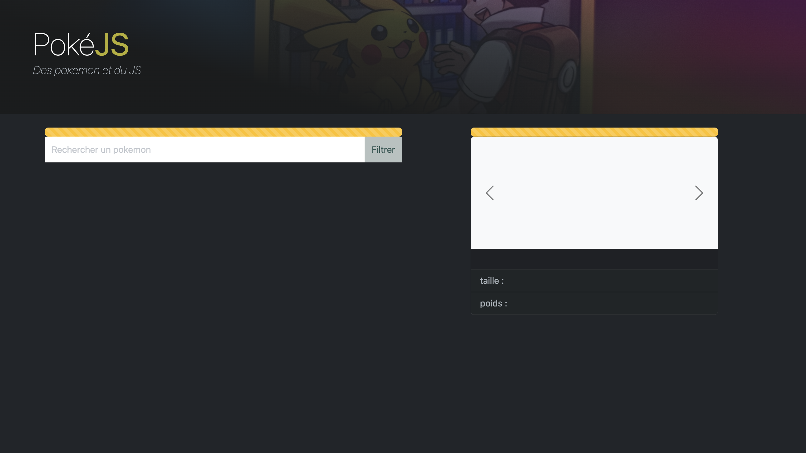
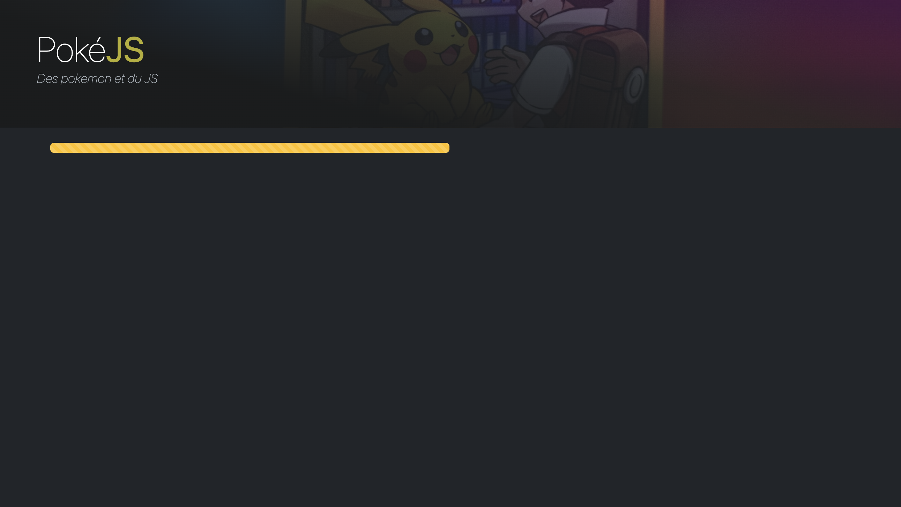
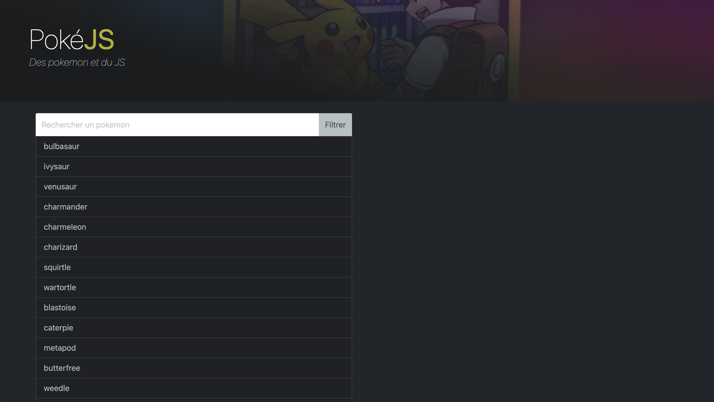
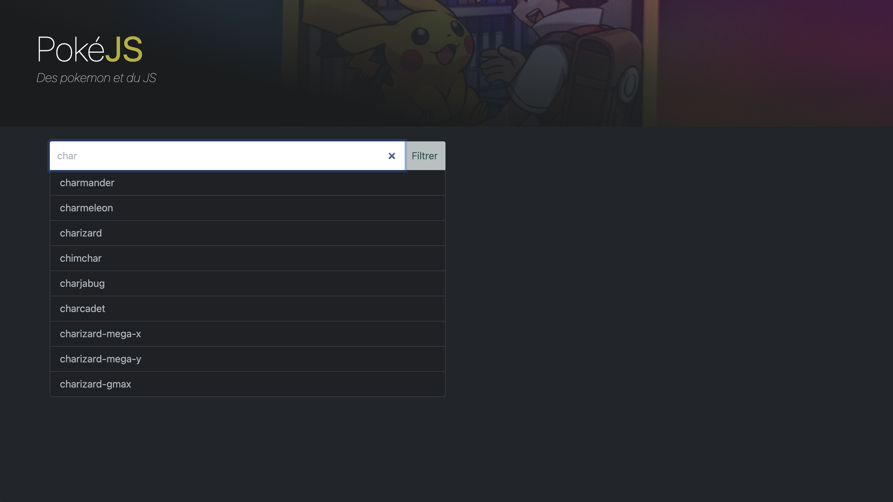
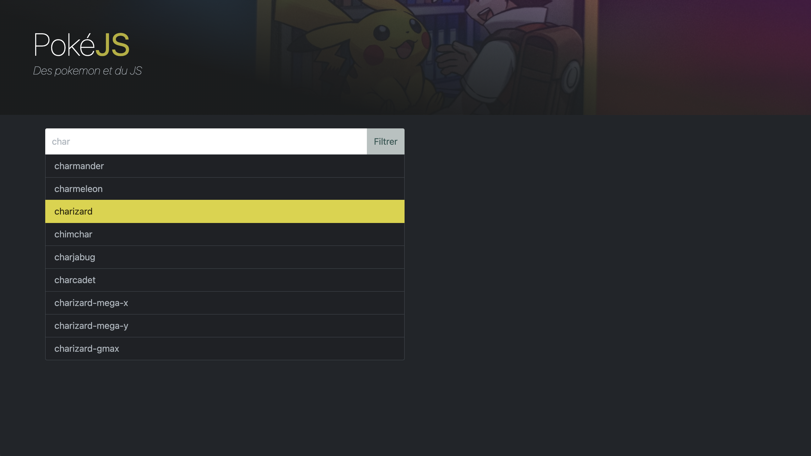
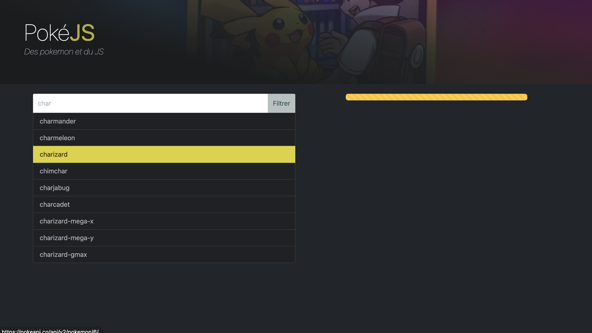
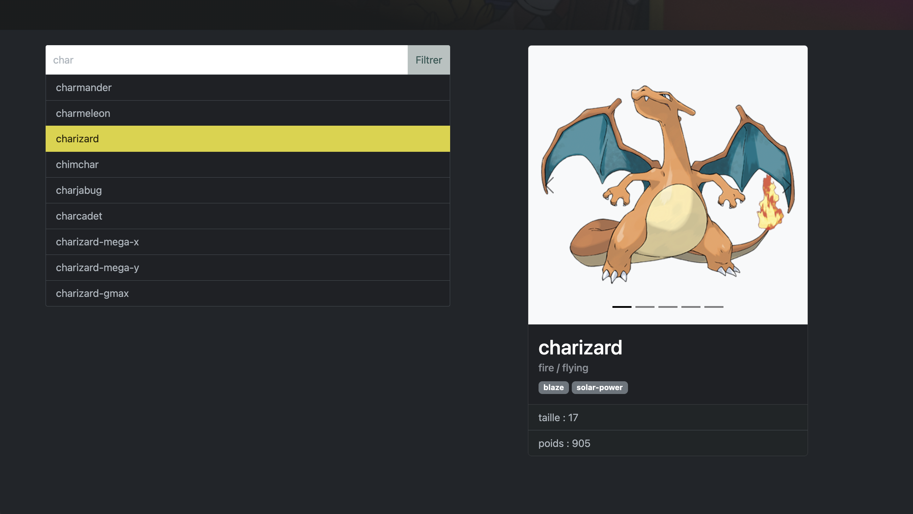
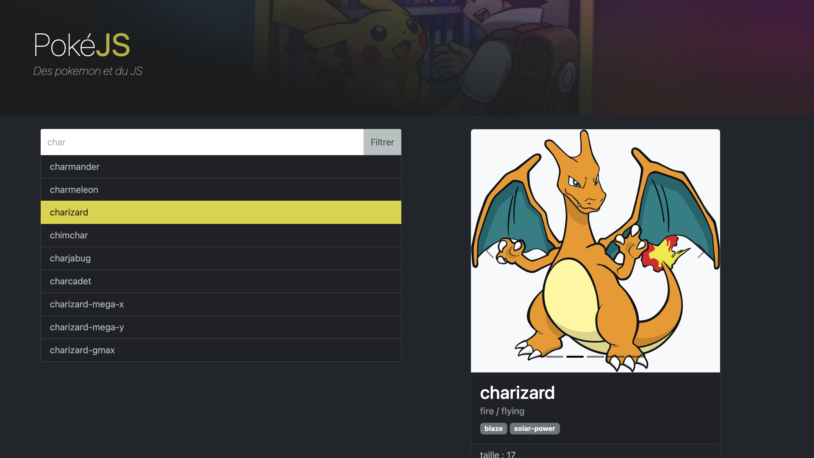

## Objectifs <!-- omit in toc -->
- Refaire un tour d'horizon de ce qui a été vu lors des TPs précédents
- Préparer le CTP de JS 😱

## Sommaire <!-- omit in toc -->
- [A. Préparatifs](#a-préparatifs)
- [B. Liste de Pokémons](#b-liste-de-pokémons)
- [C. Filtrage de la liste](#c-filtrage-de-la-liste)
- [D. Détail d'un Pokémon](#d-détail-dun-pokémon)
- [E. Carousel](#e-carousel)


**Comme le but de ce TP est de vous entrainer à réaliser seul une SPA, vous allez être beaucoup moins dirigés que lors des précédents TPs.**

N'hésitez pas à vous référer aux pdf des différents cours sur moodle, à revoir votre code des précédents TPs, ou à demander à votre encadrant.e de TP ! Profitez-en : les documents sont autorisés pour ce TP (_ce qui ne sera PAS le cas lors du CTP_ 😈).


## A. Préparatifs
1. **Faites un fork de ce TP :**
	- mettez le fork en mode "privé"
	- ajoutez votre encadrant.e de TP en "reporter" (`@patricia.everaere-caillier` ou `@thomas.fritsch`)
2. **Ouvrez le dossier du TP dans vscodium.**

	Vous constaterez que **la vie est belle** : la configuration de babel, webpack et du debug dans vscode sont déjà faites ! Vous avez aussi un fichier index.html et des css fournies, vous allez pouvoir vous concentrer sur le JS !

4. **Installez les dépendances du projet** avec `npm i`
5. **Lancez webpack-dev-server** avec `npm start`

	Vous vous souvenez à quoi exactement sert webpack-dev-server ? Non ? Alors faites vite fait un tour ici : https://gitlab.univ-lille.fr/js/tp3/-/blob/main/C-modules.md#c6-webpack-live-reload

7. **Lancez une session de debug dans vscode :**
	> _Si vous n'aviez pas pu faire cette partie du TP3 pour des questions de compatibilité de Firefox, je vous invite à :_
	> 1. _suivre le tutoriel spécifique à Firefox ici : https://gitlab.univ-lille.fr/js/tp3/-/blob/main/B-debug-vscode-firefox.md_
	> 2. _prendre connaissance des différentes possibilités offertes par le debug dans vscode ici : https://gitlab.univ-lille.fr/js/tp3/-/blob/main/B-debug-vscode.md#b2-utilisation-du-mode-debug_

	Pour lancer votre site en mode "debug dans vscode", tapez <kbd>CTRL</kbd>+<kbd>SHIFT</kbd>+<kbd>P</kbd> puis sélectionnez "Debug: Select and start debugging" ou simplement <kbd>F5</kbd>

	Choisissez le navigateur que vous souhaitez lancer (Firefox ou Chrome), une nouvelle fenêtre de votre navigateur doit s'ouvrir (_on considérera pour la suite que c'est Chrome que vous avez choisi_).

6. **Vérifiez que le rendu dans le navigateur est bien le suivant**, et si oui, vous allez pouvoir passer à la suite. \
	En cas de problème, harcelez votre encadrant.e de TP (_il ne faut pas perdre de temps sur cette étape_) !

	

## B. Liste de Pokémons

Dans ce TP vous allez :
- récupérer une liste de pokemons (en AJAX) qu'on affichera à gauche de l'écran
- au clic sur un élément de la liste, lancer un 2e appel AJAX pour récupérer le détail du pokémon cliqué et l'afficher dans la partie de droite

Commençons par nous intéresser à la liste :
1. Tout d'abord ajoutez le fichier `build/main.bundle.js` dans la page `index.html` (_actuellement il n'est pas chargé_)
2. En JS, masquez :
	- le formulaire de filtre,
	- la barre de progression de droite
	- la "card" de détail à droite

	Vous devez en principe aboutir à cet affichage :

	
3. Déclenchez au chargement de votre page, un appel AJAX vers l'api https://pokeapi.co/api/v2/pokemon?limit=-1

	> _**NB1 :** La documentation de cette API se trouve ici : https://pokeapi.co/docs/v2 (cliquez sur `Pokémon` dans le menu de gauche puis sur `Pokemon` - sans accent cette fois)_

	> _**NB2 :** On passe un paramètre `?limit=-1` pour récupérer la liste complète de tous les pokemons de la base. C'est un peu "bourrin" mais c'est ce qui nous permettra ensuite de filtrer les résultats. L'idéal aurait été d'avoir un endoint qui permette de faire la recherche via l'API (comme dans l'API rawg.io) mais ça n'est [pas prévu](https://github.com/PokeAPI/pokeapi/issues/660) dans la version REST de pokeapi._
4. A la fin de l'appel AJAX, masquez la progress bar, ré-affichez le formulaire de filtre, et injectez les résultats retournés par l'API dans la div de classe `results`. Pour chaque pokémon, affichez le code HTML suivant :
	```html
	<a href="https://pokeapi.co/api/v2/pokemon/1/" class="list-group-item list-group-item-action">
		bulbasaur
	</a>
	```
	En remplaçant bien sûr le nom et l'URL du Pokémon !

	
5. Vous constaterez qu'afficher 1279 résultats n'est pas très... pratique pour la personne qui visite votre app. **N'affichez que les 20 premiers résultats !**

## C. Filtrage de la liste

Maintenant que vous avez récupéré les pokémons de la bdd, faites en sorte que lorsque l'utilisateur tape quelque chose dans le champ de recherche ([événement `'input'` _(mdn)_](https://developer.mozilla.org/fr/docs/Web/API/HTMLElement/input_event)), on affiche en dessous les 20 premiers pokémons dont le nom contient la chaîne recherchée (s'il y en a moins de 20 qui correspondent, on les affiche tous) :



## D. Détail d'un Pokémon

Faites en sorte maintenant que quand on clique sur un pokémon de la liste, le détail s'affiche ! Pour cela

1. Ajoutez la classe "active" sur le lien qui a été cliqué (_et l'enlever du précédent lien_)

	

2. Affichez la progress bar du détail :

	

3. Déclenchez un appel AJAX vers l'URL du pokemon cliqué (fournie dans les résultat du premier appel AJAX). Par exemple si l'on clique sur `bulbasaur`, l'appel AJAX qu'on fera sera vers https://pokeapi.co/api/v2/pokemon/1/ .

	Une fois le résultat obtenu, masquez la progress bar, affichez le détail et injectez :
	- dans `<div class="carousel-inner"></div>`, une balise :
		```html
		<div class="carousel-item active">
			
		</div>
		```
		où le src correspond à une des images du champ `sprites` retourné par l'API.
	- dans `<h2 class="card-title"></h2>`, le nom du pokemon.
	- dans `<h6 class="card-subtitle mb-2 text-muted"></h6>`, ses `types` séparés par `' / '`
	- dans `<p class="badgesContainer card-text"></p>`, ses `abilities`, avec pour chaque ability le code suivant :
		```html
		<span class="badge text-bg-secondary">....</span>
		```
	- dans les deux `<li>`, la taille et le poids du pokémon :
		```html
		<ul class="list-group list-group-flush">
			<li class="list-group-item">taille : XX</li>
			<li class="list-group-item">poids : YY</li>
		</ul>
		```

Si tout est OK, le rendu doit être :



## E. Carousel

**Pour terminer, vous remarquerez que l'image de la carte de détail dispose de flèches vers la gauche et la droite. Sur la capture d'écran précédente, vous voyez aussi que j'ai une sorte de "pagination" en bas de l'image.**

Si vous inspectez aussi ce que vous retourne l'API de détail, vous remarquerez aussi que dans le champ `sprites` on a beaucoup d'images différentes. On va donc s'en servir pour afficher un diaporama.

**Codez donc maintenant une classe `Carousel` :**
- dans le constructeur passez lui l'élément `<div class="carousel card-img-top slide bg-light">`
- ajoutez une méthode `setImages(images)` qui va :
	- ajouter autant de balises identiques à celle qu'on a déjà dans le `carousel-inner` (avec la classe `active` uniquement sur la première image)
	- ajouter dans la balise `<div class="carousel-indicators"></div>` des liens de pagination (1 par image) :
		```html
		<button type="button" data-bs-target="#" data-bs-slide-to="X"></button>
		```
		où `X` est l'index du bouton dans la liste.
- faites ensuite en sorte que les boutons de pagination permettent de :
	+ changer l'image ayant la classe `active`
	+ ajouter la classe `active` sur le lien de pagination courant
- enfin faites fonctionner les boutons `carousel-control-prev` et `carousel-control-next`

